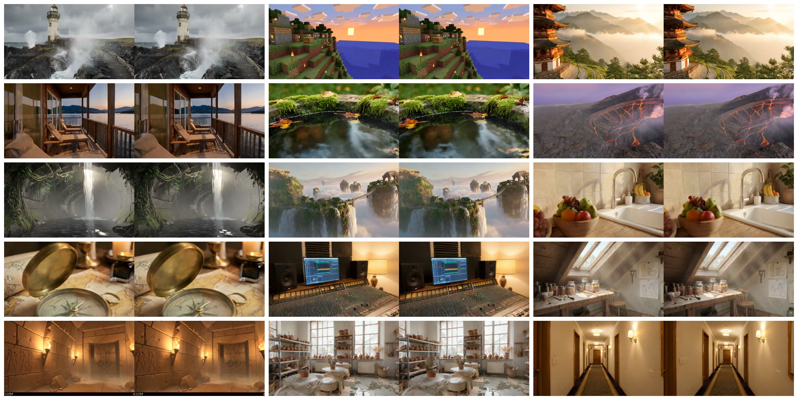

# Stereo World Model: Camera-Guided Stereo Video Generation

[](https://arxiv.org/abs/2603.17375)
[](https://sunyangtian.github.io/StereoWorld-web/)


StereoWorld generates stereo video from one input image and a text prompt. The camera trajectory is controlled by action tokens, and the output video is saved as a side-by-side left/right stereo MP4.

## Demo Gallery



## Features

- Camera-guided stereo video generation from a single RGB image.
- WASD-style camera controls for translation, yaw, and pitch.
- Side-by-side stereo output with configurable stereo baseline.
- Single-GPU inference and optional multi-GPU sequence-parallel inference.

## Installation

Create a Python environment and install the dependencies:

```bash
python3 -m venv .venv
source .venv/bin/activate
pip install --upgrade pip
pip install -r requirements.txt
```

The code is tested with CUDA 12.6 and PyTorch 2.4+. For faster attention, install `flash-attn` if it is compatible with your CUDA/PyTorch environment. Multi-GPU sequence parallel inference additionally requires `xfuser` and its dependencies.

## Model Weights

Download or prepare the StereoWorld pipeline weights in the following layout:

```text
weights/stereoworld_v1/pipeline/
  transformer/
  vae/
  tokenizer/
  text_encoder/
  scheduler/
```

You can also keep the weights elsewhere and pass `--pipeline_dir /path/to/stereoworld_v1/pipeline`.

## TODO

- [x] Open-source the 5-second, 832x480 binocular teacher model.
- [ ] Release the few-step student model.
- [ ] Release more flexible multi-view world model.

## Quick Start

Run the included single-image demo:

```bash
bash run_single.sh --pipeline_dir /path/to/stereoworld_v1/pipeline
```

Run on multiple GPUs:

```bash
bash run.sh --pipeline_dir /path/to/stereoworld_v1/pipeline --num_gpus 4
```

By default, the scripts use `ExpData/demo_single_eval.json`, which points to the sample input image included in this repository. `ExpData/demo_custom_eval.json` contains a larger 100-entry prompt/action list; use it only after placing the corresponding input images under `ExpData/demo_custom/`.

## Custom Inference

Batch inference from an eval JSON:

```bash
python3 inference.py \
  --pipeline_dir /path/to/stereoworld_v1/pipeline \
  --eval_json /path/to/eval.json \
  --output_dir output \
  --H 480 --W 832 \
  --num_frames 81 \
  --baseline 0.2
```

Single-folder inference:

```bash
python3 inference.py \
  --pipeline_dir /path/to/stereoworld_v1/pipeline \
  --input_dir /path/to/sample_folder \
  --action_seq w wl wj \
```

For `--input_dir`, the folder should contain:

```text
sample_folder/
  left.png
  caption.txt
```

For `--eval_json`, each entry should contain:

```json
{
  "image_path": "./demo_custom/example.png",
  "caption": "A descriptive text prompt.",
  "action_seq": ["w", "wl", "wj"],
  "scene_name": "example_scene"
}
```

Relative `image_path` values are resolved relative to the JSON file. `scene_name` is optional; when omitted, the image filename is used.

## Camera Actions

| Key | Motion |
| --- | --- |
| `w` | move forward |
| `s` | move backward |
| `a` | move left |
| `d` | move right |
| `j` | yaw left |
| `l` | yaw right |
| `i` | pitch up |
| `k` | pitch down |

## Outputs

Each job writes:

- `{scene_name}.mp4`: side-by-side stereo video, left view on the left and right view on the right.
- `{scene_name}.json`: metadata including caption, action sequence, baseline, intrinsics, and camera poses.

`num_frames` must satisfy `1 + 4k`, for example `81` or `121`. Height and width must be divisible by 8.

## Citation

If you find our work useful, please consider citing:

```bibtex
@article{sun2026stereo,
  title={Stereo World Model: Camera-Guided Stereo Video Generation},
  author={Sun Yang-Tian and Huang Zehuan and Niu Yifan and Ma Lin and Cao Yan-Pei and Ma Yuewen and Qi Xiaojuan},
  journal={arXiv preprint arXiv:2603.17375},
  year={2026}
}
```
