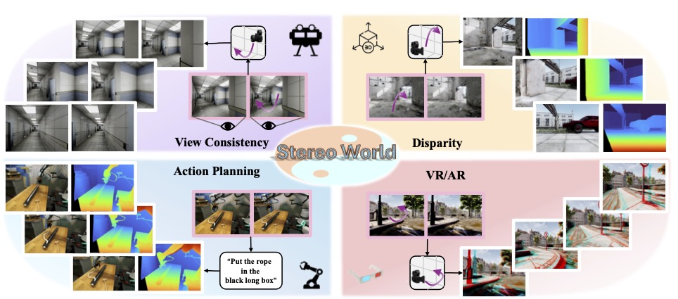

# Stereo World Model: Camera-Guided Stereo Video Generation

[](https://arxiv.org/abs/2603.17375)
[](https://sunyangtian.github.io/StereoWorld-web/)



### 🌟 Features
- **Stereo vision** –– the dominant perceptual mechanism in many biological systems provides direct, robust geometric cues to 3D scene structure.
- **StereoWorld** –– a stereo world model capable of performing exploration based on given binocular images,

### 📒 Code \& Weights
We are currently in the final stage of the code \& model release process. Please stay tuned for updates.

### Citation
---
If you find our work useful, please consider citing:
```
@article{sun2026stereo,
        title={Stereo World Model: Camera-Guided Stereo Video Generation},
        author={Sun Yang-Tian and Huang Zehuan and Niu Yifan and Ma Lin and Cao Yan-Pei and Ma Yuewen and Qi Xiaojuan},
        journal={xxx},
        year={2026}
      }
```